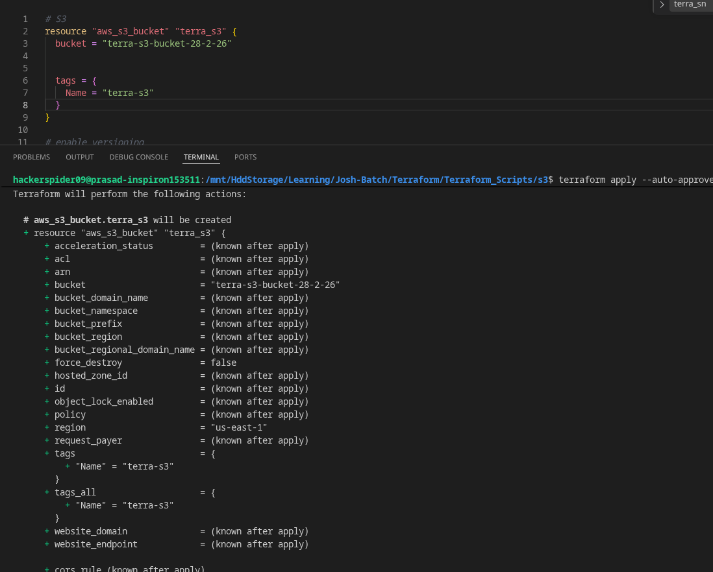
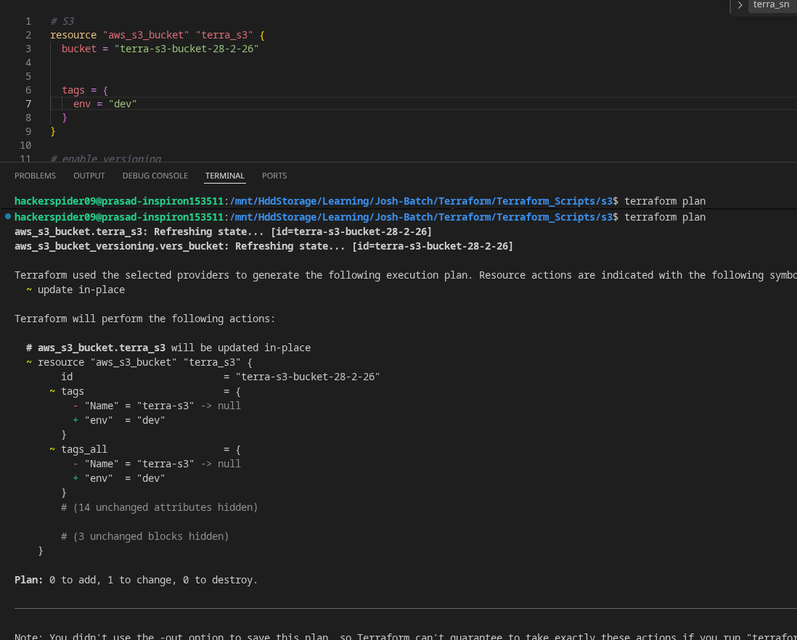
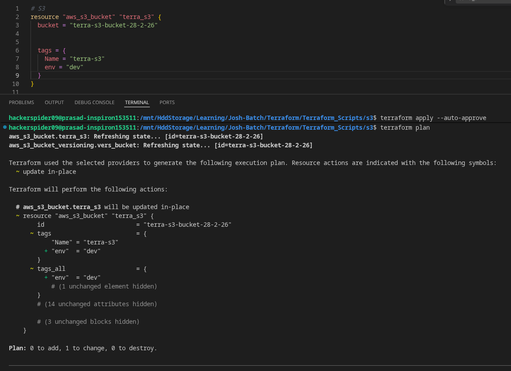
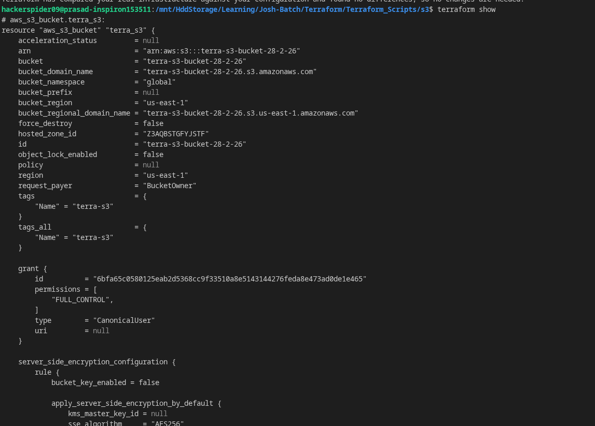
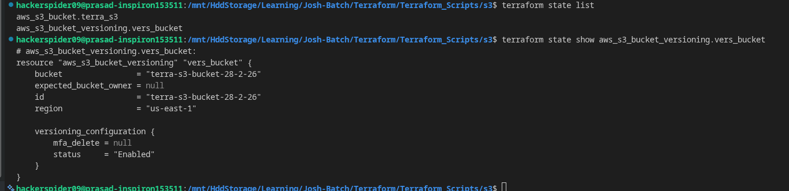

# Terraform Scripts and notes

# AWS

Configure account on CLI by aws configure command and it stores the credentials in ~/.aws/credentials and configuration in ~/.aws/config

### Add another profile

```
aws configure --profile username
```

### Use --profile flag for command

```
aws s3 ls --profile username
```

### Verify profile

```
aws sts get-caller-identity
```

### For crnt session set env AWS_PROFILE

```
export AWS_PROFILE=user1
```
---

# Terraform State File

Terraform uses a state file to keep track of the infrastructure it manages. This file is usually named `terraform.tfstate`.

The state file contains:

- Resource IDs and names
- Current values of resource attributes
- Dependencies between resources
- Mapping between Terraform configuration and real infrastructure
- Outputs and metadata

Terraform reads this file during `plan` and `apply` to determine what has changed.

Do not edit the state file manually. Incorrect changes can corrupt the state and cause Terraform to create, update, or delete the wrong resources.

Do not commit the state file to Git because it may contain sensitive information such as passwords, access keys, secrets, and infrastructure details.

## Terraform Lock File

Terraform also creates a lock file named `.terraform.lock.hcl`.

The lock file stores:

- Exact versions of providers being used
- Checksums for provider verification

This ensures everyone using the project installs the same provider versions.

Unlike the state file, the lock file should be committed to Git.

> “State file” is the general term
> `terraform.tfstate` is the default filename Terraform uses for that file

---

# Terraform plan symbols

~, -, + are used in output of terraform plan indicates specific type of changes intended to make to infra

### +(Create):

- This indicates terraform will create new resource that doesn't exists in infra



### -(Destroy):

- This indicates terraform will destroy from resource as per config



### ~(Update):

- This indicates terraform will update resource or try to modify existing resource without recreating or deleting



---
# Common Terraform Commands

- `terraform init`
  Initializes the Terraform working directory and downloads required providers/modules.

  Common flags:

  - `-upgrade` → Upgrade provider and module versions
  - `-backend=false` → Skip backend initialization
  - `-reconfigure` → Reconfigure backend settings
  - `-migrate-state` → Migrate existing state to a new backend
- `terraform validate`
  Validates Terraform configuration files for syntax and internal consistency.

  Common flags:

  - `-json` → Output validation results in JSON format
  - `-no-color` → Disable colored output
- `terraform plan`
  Creates an execution plan showing what Terraform will add, change, or destroy.

  Common flags:

  - `-out=tfplan` → Save the plan to a file
  - `-var="key=value"` → Set a variable value
  - `-var-file="terraform.tfvars"` → Load variables from a file
  - `-destroy` → Create a plan to destroy infrastructure
  - `-target=<resource>` → Plan changes for a specific resource only
  - `-refresh=false` → Skip refreshing state before planning
- `terraform apply`
  Applies the planned infrastructure changes.

  Common flags:

  - `-auto-approve` → Skip interactive approval prompt
  - `tfplan` → Apply a previously saved plan file
  - `-var="key=value"` → Set a variable value
  - `-var-file="terraform.tfvars"` → Load variables from a file
  - `-target=<resource>` → Apply changes to a specific resource only
  - `-destroy` → Destroy infrastructure instead of creating/updating

### Example

```bash
terraform init -upgrade
terraform validate
terraform plan -out=tfplan
terraform apply tfplan
```

---
# Useful Terraform State Commands

- `terraform show`
  Displays the current Terraform state in a human-readable format.



- `terraform state list`
  Lists all resources currently managed by Terraform.
- `terraform state show aws_s3_bucket.<name>`
  Shows detailed information about a specific S3 bucket resource.
- `terraform state show aws_instance.<name>`
  Shows detailed information about a specific EC2 instance resource.



### Example

```bash
terraform show
terraform state list
terraform state show aws_s3_bucket.my_bucket
terraform state show aws_instance.my_server
```
