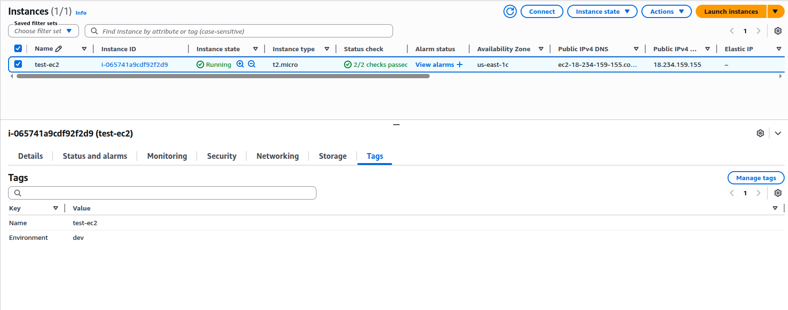
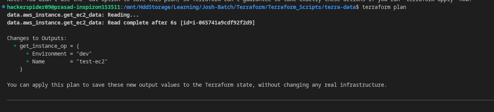
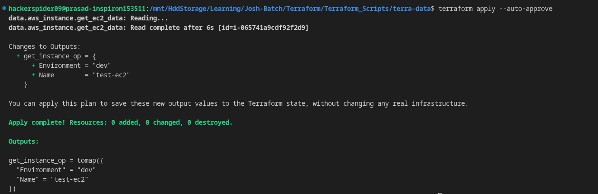
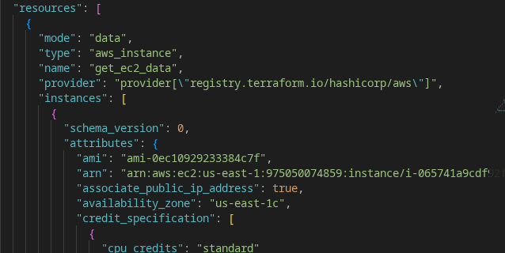

# Terraform Data Block Practical

## Step 1

Create one EC2 manually from AWS Console.

Example:

* Name = `test-ec2`
* Tags:

  * `Environment = dev`
  * `Name = test-ec2`



---

## Step 2

Add data block in Terraform.

```hcl
data "aws_instance" "get_ec2_data" {
  instance_id = "i-065741a9cdf92f2d9"
}
```

---

## Step 3

Run:

```bash
terraform init
terraform plan
```

Terraform does not create anything. It only reads existing EC2 information.

You should see something like:

```text
data.aws_instance.get_instance_data: Reading...
data.aws_instance.get_instance_data: Read complete
```



---

## Step 4

Run:

```bash
terraform apply
```

Terraform shows the output value fetched from existing EC2.




---

## Note

`data` block does not create or manage resource.

It only reads existing information and can be used in:

* output
* another resource
* variable or local


