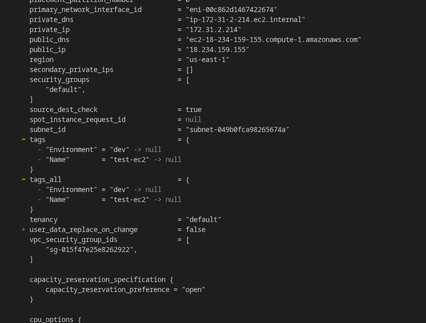
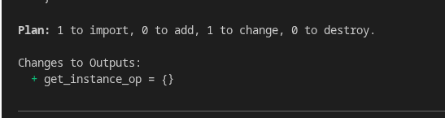
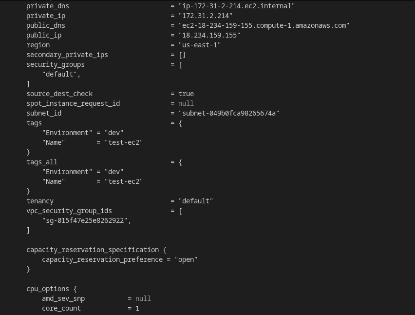
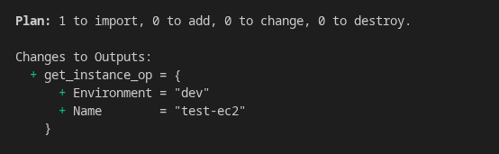
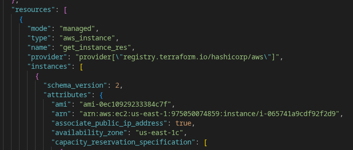

# Terraform Import Practical

## Step 1

Create one EC2 manually from AWS Console.

Example:

* Name = `test-ec2`
* Tags:

  * `Environment = dev`
  * `Name = test-ec2`


---

## Step 2

Minimal Terraform code.

```hcl
resource "aws_instance" "get_instance_res" {
    ami = "ami-0ec10929233384c7f"
    instance_type = "t2.micro"
}
```

Then import the instance.

```bash
terraform init
terraform plan
```

Terraform shows tags will be removed because they are not present in code.

Example:

```diff
- Environment = dev
- Name = test-ec2
```



Output block



---

## Step 4

Add those tags in Terraform code.

```hcl
resource "aws_instance" "get_instance_res" {
    ami = "ami-0ec10929233384c7f"
    instance_type = "t2.micro"
    tags = {
      "Environment" = "dev"
      "Name"        = "test-ec2"
    }
}
```

Run again:

```bash
terraform plan
```

Now it should not show tag removal.



Output block



---

## Note

`terraform import` only adds resource to state.
It does not add existing tags or settings into code.

Always do:

```text
terraform import
terraform plan
Add missing values in code
terraform plan again
terraform apply
```

After running import, Terraform adds the existing EC2 information into `terraform.tfstate`.

Now Terraform knows that this EC2 instance is managed by this resource block:

```hcl
resource "aws_instance" "get_instance_res"
```
